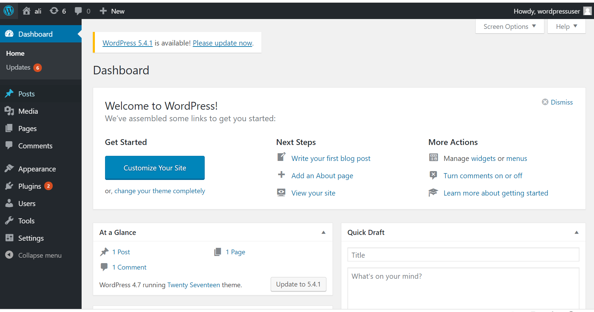

# 实验5 web 服务器的搭建

## 实验环境

win10主机

Nginx

VeryNginx

Wordpress

WordPress 4.7 | 备用下载地址

Damn Vulnerable Web Application (DVWA)

## 实验环境搭建

### 修改本地hosts文件

cmd输入notepad,然后找到hosts文件所在文件夹，并向文件中加入：

ubuntu ip地址 后接

`wp.sec.cuc.edu.cn`

`dvwa.sec.cuc.edu.cn`

`vn.sec.cuc.edu.cn`

### 安装`nginx`

只需要执行
`sudo apt install nginx `

要检查`nginx`是否安装成功可以执行`nginx -t`来验证是否安装成功

###安装`Verynginx`

如果开启nginx需要先关闭nginx

首先下载依赖相关：

`sudo apt install libssl libssl1.0-dev`
`sudo apt install zlib1g-dev`
`apt install libpcre3 libpcre3-dev`

将`VeryNgnx`仓库克隆到本地
`git clone https://github.com/alexazhou/VeryNginx.git`

`cd VeryNginx`

下载`Veryngnx`:
`sudo python install.py install`

修改`/opt/verynginx/openresty/nginx/conf/nginx.conf`文件配置,将server模块监听端口改为8080

第一次下载时因为没补齐依赖导致下载不完全，  `/opt/`文件夹中没有verynginx文件夹，问题还挺难发现的。

启动服务
`/opt/verynginx/openresty/nginx/sbin/nginx`

运行结果：

### 安装`wordpress`

进入Mysql

`mysql -u root -p`

创建`wordpress`数据库

`CREATE DATABASE wordpress DEFAULT CHARACTER SET utf8 COLLATE utf8_unicode_ci;`

创建账户，设置密码：
`GRANT ALL ON wordpress.* TO 'wordpressuser'@'localhost' IDENTIFIED BY 'password';`

刷新更改 
`FLUSH PRIVILEGES;`

注意mysql语句执行需要以'；'作为结尾

### PHP：

安装相关拓展 
`sudo apt update`
`sudo apt install php-curl php-gd php-intl php-mbstring php-soap php-xml php-xmlrpc php-zip`

重启php7.2-fpm 
`sudo systemctl restart php7.2-fpm`

### `wordpress`下载：

下载到tmp文件夹中：
`cd /tmp`

将安装包下载至临时目录
`curl -LO https://wordpress.org/wordpress-4.7.tar.gz`

解压
`tar xzvf wordpress-4.7.tar.gz`

复制配置文件到wordpress实际读取的文件中

`cp /tmp/wordpress/wp-config-sample.php /tmp/wordpress/wp-config.php`

创建wordpress根目录

`mkdir /var/www/html/wq.sec.cuc.edu.cn`

 将tmp目录下文件复制到根目录
 
 `sudo cp -a /tmp/wordpress/. /var/www/html/wq.sec.cuc.edu.cn`

分配文件所有权至nginx运行的用户和组
 
 `sudo chown -R www-data:www-data /var/www/html/wq.sec.cuc.edu.cn`

### Nginx配置：

修改`wp-config.php`,修改wordpress库相关信息：
数据库名：`wordpress`
mysql数据库名：`root`
密码：自己设定的密码

为wordpress创建配置文件`/etc/nginx/sites-available/wp.sec.cuc.edu.cn`
向文件中加入以下内容
server {
    listen 8087;
    listen [::]:8087 ipv6only=on;

    root /var/www/html/wp.sec.cuc.edu.cn;

    index index.php index.html index.htm index.nginx-debian.html;

    server_name 192.168.231.5；

     location / {
        try_files \$uri \$uri/ /index.php?\$args;
    }

    location ~ .*\.(js|css)?$
        {
            proxy_pass http://192.168.231.5:8087;
        }

    location ~ \.php$ {
            include snippets/fastcgi-php.conf;
            fastcgi_pass unix:/var/run/php/php7.2-fpm.sock;
    }

    location ~ /\.ht{
            deny all;
    }
}

记得检查确保设置的多个端口不同！
第一次设置时我把`verynginx`和`wordpress`的端口都设为了8080

 在sites-enabled目录下创建一个该可用站点的软链接, 同时删除该目录下的default文件以禁用该站点  

`ln -s /etc/nginx/sites-available/${WP_DOMAIN} /etc/nginx/sites-enabled/
rm /etc/nginx/sites-enabled/default`

检查配置文件是否正确
`nginx -t`

记得时时检查nginx配置文件是否存在问题！如果多次修改的话，以保证确定Nginx配置文件不存在语法或其他错误，如果有误会由提示，错误出在多少行

若正确则重新启动Nginx

`sudo systemctl restart nginx`

访问：

### 安装DVWA

下载DVWA:

在/var/www/html下为DVWA创建目录
`sudo mkdir /var/www/html/DVWA`

克隆到临时目录下

`git clone https://github.com/ethicalhack3r/DVWA /tmp/DVWA`

拷贝到/var/www/html/DVWA网站根目录下

`sudo rsync -avP /tmp/DVWA/ /var/www/html/DVWA`

配置DVWA：

数据库配置：
复制config.inc.php.dist到config.inc.php

`cp /var/www/html/DVWA/config/config.inc.php.dist /var/www/html/DVWA/config/config.inc.ph`

在MySQL中创建用户和数据库并修改DVWA文件配置
`sudo sudo vim /var/www/html/DVWA/config/config.inc.php`

`$_DVWA[ 'db_server' ]   = '127.0.0.1';`
`$_DVWA[ 'db_database' ] = 'dvwa';`
`$_DVWA[ 'db_user' ]     = 'dvwauser';`
`$_DVWA[ 'db_password' ] = 'p@ssw0rd';`

修改/etc/php/7.2/fpm/php.ini 
vim /etc/php/7.2/fpm/php.ini

修改  php 设置

`allow_url_include = On`

`allow_url_fopen = On`

`display_errors = Off`

修改权限：

`chown -R www-data.www-data /var/www/html/`

配置Nginx文件，和上面wordpress的设置相同，不过要注意，端口要不一样

访问：

## 基本要求

##### 在一台主机（虚拟机）上同时配置Nginx和VeryNginx
`VeryNginx作为本次实验的Web App的反向代理服务器和WAF：`

`PHP-FPM进程的反向代理配置在nginx服务器上，VeryNginx服务器不直接配置Web站点服务
使用Wordpress搭建的站点对外提供访问的地址为： http://wp.sec.cuc.edu.cn

使用Damn Vulnerable Web Application (DVWA)搭建的站点对外提供访问的地址为： http://dvwa.sec.cuc.edu.cn`

配置好match：

配置好upstream和proxy:

访问：

dvwa:

wordpress:

#### 安全加固要求
`使用IP地址方式均无法访问上述任意站点，并向访客展示自定义的友好错误提示信息页面-1`

matcher配置：

response配置：

filter配置：

访问：

`Damn Vulnerable Web Application (DVWA)只允许白名单上的访客来源IP，其他来源的IP访问均向访客展示自定义的友好错误提示信息页面-2`

`在不升级Wordpress版本的情况下，通过定制VeryNginx的访问控制策略规则，热修复WordPress < 4.7.1 - Username Enumeration`

#### VeryNginx配置要求

VeryNginx的Web管理页面仅允许白名单上的访客来源IP，其他来源的IP访问均向访客展示自定义的友好错误提
示信息页面-3
设置matcher,response,filter再访问

通过定制VeryNginx的访问控制策略规则实现：
限制DVWA站点的单IP访问速率为每秒请求数 < 50
限制Wordpress站点的单IP访问速率为每秒请求数 < 20
超过访问频率限制的请求直接返回自定义错误提示信息页面-4

禁止curl访问：

参考资料：

参考链接：
Ubuntu 18.04 搭建 WordPress
https://my.oschina.net/yingximu/blog/1931050

手动编译 Nginx 并安装 VeryNginx
https://blog.csdn.net/weixin_33907511/article/details/94535509 

解决nginx设置反向代理后，css|js|gif|jpg|jpeg|png|bmp|swf等静态资源无法加载

https://blog.csdn.net/Honiler/article/details/89874052?utm_medium=distribute.pc_relevant.none-task-blog-BlogCommendFromMachineLearnPai2-4.nonecase&depth_1-utm_source=distribute.pc_relevant.none-task-blog-BlogCommendFromMachineLearnPai2-4.nonecase
 

https://github.com/CUCCS/linux-2019-luyj/blob/Linux_exp0x05/Linux_exp0x05/Linux_exp0x05.md#结果截图

https://github.com/CUCCS/linux-2019-Sismark/blob/b3db13182b7fe4e38afe548f80ceb5aef5f868e9/chap0x05/chap0x05%20web服务器.md
